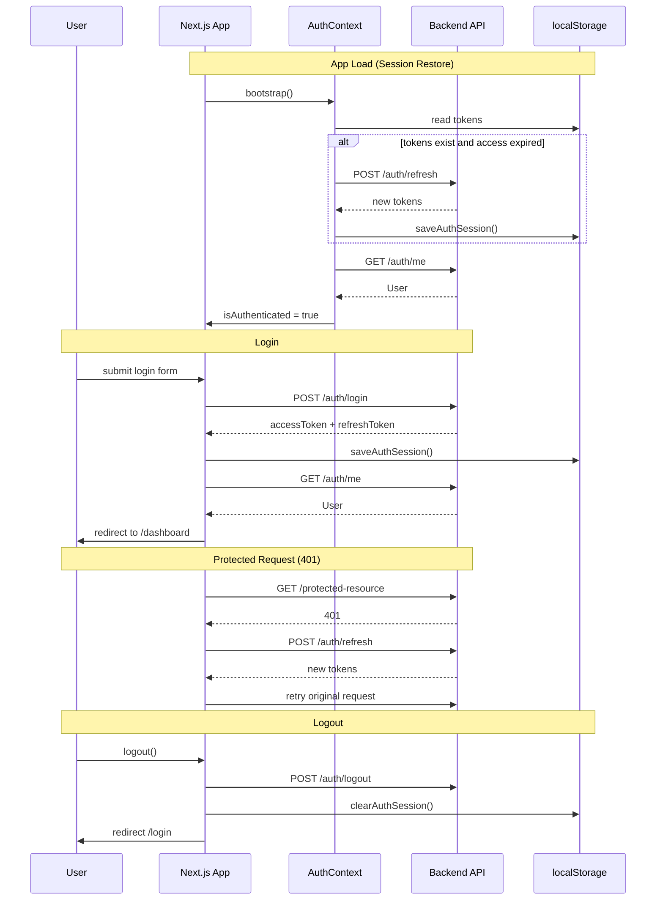

# CredXP Dubai — Authentication Integration Report

**Generated:** 2026-06-24  
**Backend:** `https://backend-cumg.onrender.com`  
**OpenAPI version:** v0.3.0 (discovered via `/docs/swagger-ui-init.js`)

---

## Summary

The frontend implements a production-ready authentication flow against the **live** CredXP Dubai backend. Session persistence uses **access + refresh JWT tokens** returned in JSON (no HttpOnly cookies from the backend).

| Feature | Status |
|---------|--------|
| Login | ✅ `POST /api/v1/auth/login` |
| Logout | ✅ `POST /api/v1/auth/logout` |
| Session refresh | ✅ `POST /api/v1/auth/refresh` |
| Current user | ✅ `GET /api/v1/auth/me` |
| Register | ✅ via `POST /api/v1/users` (no dedicated `/auth/register`) |
| Forgot password | ⚠️ UI ready — backend route **404** |
| Reset password | ⚠️ UI ready — backend route **404** |
| Email verification | ⚠️ UI hook ready — backend route **404** |
| Protected routes | ✅ Dashboard, Profile, Saved Properties, Settings |
| Session persistence | ✅ localStorage + bootstrap on app load |
| 401 handling | ✅ Axios interceptor + token refresh |

---

## Backend Endpoints Used

### `POST /api/v1/auth/login`

**Request:**
```json
{
  "email": "user@example.com",
  "password": "your-password"
}
```

**Response (`200`):**
```json
{
  "accessToken": "eyJ...",
  "refreshToken": "eyJ...",
  "expiresIn": 900,
  "tokenType": "Bearer"
}
```

**Errors:**
- `401` — invalid credentials (`UNAUTHORIZED`)
- `400` — validation error

---

### `POST /api/v1/auth/refresh`

**Request:**
```json
{
  "refreshToken": "eyJ..."
}
```

**Response (`200`):** Same shape as login (`AuthTokenResponse`).

**Errors:**
- `401` — invalid/expired refresh token → frontend clears session and redirects to `/login`

---

### `POST /api/v1/auth/logout`

**Request (optional body):**
```json
{
  "refreshToken": "eyJ..."
}
```

**Response:** `204` or `200` (empty body)

Revokes refresh token server-side when provided. Frontend always clears local tokens.

---

### `POST /api/v1/auth/logout-all`

**Request:** Empty body (Bearer access token required)

**Response:** Revokes all sessions for the user.

*Not wired in UI yet; available in `src/lib/api/auth.ts`.*

---

### `GET /api/v1/auth/me`

**Headers:** `Authorization: Bearer <accessToken>`

**Response (`200`):**
```json
{
  "id": "uuid",
  "email": "user@example.com",
  "firstName": "Jane",
  "lastName": "Doe",
  "status": "ACTIVE",
  "roleId": "uuid",
  "createdAt": "2026-01-01T00:00:00.000Z",
  "updatedAt": "2026-01-01T00:00:00.000Z"
}
```

**Errors:**
- `401` — missing/invalid token

---

### `POST /api/v1/users` (Registration)

There is **no** `POST /api/v1/auth/register` on v0.3.0. Registration uses the users API.

**Request:**
```json
{
  "email": "user@example.com",
  "password": "secure-password",
  "firstName": "Jane",
  "lastName": "Doe"
}
```

**Response (`201`):** `User` object (same fields as `/auth/me`).

**Frontend mapping:** Register form `name` → `firstName` + `lastName`.

**Note:** If the backend requires admin auth for user creation, registration will return `401/403` until a public signup route is added.

---

### Not Available (404 on v0.3.0)

| Route | Frontend handling |
|-------|-------------------|
| `POST /api/v1/auth/forgot-password` | Shows capability notice; `forgotPassword()` throws descriptive `ApiError` |
| `POST /api/v1/auth/reset-password` | Shows capability notice; expects `?token=` in URL when backend adds support |
| `POST /api/v1/auth/verify-email` | `verifyEmail()` throws descriptive `ApiError` |

---

## Token Strategy

**Backend returns:** Access JWT + optional Refresh JWT in JSON (not cookies).

**Frontend storage** (`src/lib/auth/session.ts`):
- `credxp_access_token` — access token
- `credxp_refresh_token` — refresh token (if provided)
- `credxp_token_meta` — `expiresIn`, `tokenType`, `expiresAt`

**Security notes:**
- HttpOnly cookies were **not** available from the backend response.
- Tokens are stored in `localStorage` (standard SPA pattern for this API).
- On 401, the Axios interceptor attempts one refresh via `POST /api/v1/auth/refresh`, then retries the original request.
- If refresh fails, session is cleared and user is redirected to `/login?redirect=...`.

---

## Authentication Flow



---

## Protected Routes

| Route | Component | Guard |
|-------|-----------|-------|
| `/dashboard` | `(protected)/dashboard/page.tsx` | `ProtectedRoute` |
| `/profile` | `(protected)/profile/page.tsx` | `ProtectedRoute` |
| `/saved-properties` | `(protected)/saved-properties/page.tsx` | `ProtectedRoute` |
| `/settings` | `(protected)/settings/page.tsx` | `ProtectedRoute` |

Unauthenticated access redirects to:
```
/login?redirect=<original-path>
```

---

## Public Auth Routes

| Route | Purpose |
|-------|---------|
| `/login` | Email + password sign in |
| `/register` | Name, email, password, confirm password |
| `/forgot-password` | Request reset email (backend pending) |
| `/reset-password?token=...` | Set new password (backend pending) |

Authenticated users visiting auth pages are redirected to `/dashboard`.

---

## Frontend Architecture

### API layer
- `src/lib/api/auth.ts` — `login`, `register`, `logout`, `forgotPassword`, `resetPassword`, `verifyEmail`, `getCurrentUser`, `refreshToken`
- `src/lib/api/client.ts` — Axios instance, Bearer header, 401 refresh interceptor

### State
- `src/context/AuthContext.tsx` — `currentUser`, `isAuthenticated`, `loading`, `login`, `logout`, `refreshUser`
- `src/lib/auth/session.ts` — token persistence

### React Query hooks
- `src/hooks/useAuth.ts` — `useLoginMutation`, `useRegisterMutation`, `useCurrentUserQuery`, `useLogoutMutation`, etc.

### Components
- `src/components/auth/ProtectedRoute.tsx`
- `src/components/auth/LoginForm.tsx`, `RegisterForm.tsx`, `ForgotPasswordForm.tsx`, `ResetPasswordForm.tsx`
- `src/components/layout/Navbar.tsx` — Login/Register vs Avatar/Dashboard/Logout

### Types
- `src/types/auth.ts` — form values, `AuthContextValue`, `AuthSession`
- `src/types/api.ts` — `AuthTokenResponse`, `User`, `CreateUserRequest`

---

## Error Handling

Backend errors use this envelope:
```json
{
  "error": {
    "code": "UNAUTHORIZED",
    "message": "Invalid email or password",
    "correlationId": "..."
  }
}
```

Parsed by `ApiError` in `src/lib/api/client.ts` and displayed via:
- Inline form errors (auth pages)
- `react-hot-toast` notifications (login success, logout, register success)

---

## Verification Checklist

| Test | Expected |
|------|----------|
| Register | Creates user via `POST /api/v1/users`, redirects to login |
| Login | Returns tokens, fetches `/auth/me`, redirects to dashboard |
| Refresh page | Session restored from localStorage, no logout flicker |
| Protected routes | Redirect to `/login` when unauthenticated |
| Logout | Clears tokens, calls `/auth/logout`, redirects to login |
| Forgot password | Shows backend-not-available notice (v0.3.0) |
| Reset password | Shows backend-not-available notice (v0.3.0) |
| Expired access token | Auto-refresh via interceptor |

---

## Environment

```env
NEXT_PUBLIC_API_URL=https://backend-cumg.onrender.com
```

---

## Files Added/Modified for Auth

```
src/types/auth.ts
src/lib/auth/session.ts
src/lib/auth/utils.ts
src/lib/api/auth.ts
src/lib/api/client.ts
src/lib/api/users.ts
src/context/AuthContext.tsx
src/hooks/useAuth.ts
src/components/auth/*
src/components/layout/Navbar.tsx
src/components/providers/AppProviders.tsx
src/app/(auth)/*
src/app/(protected)/*
src/app/layout.tsx
src/app/globals.css
```
