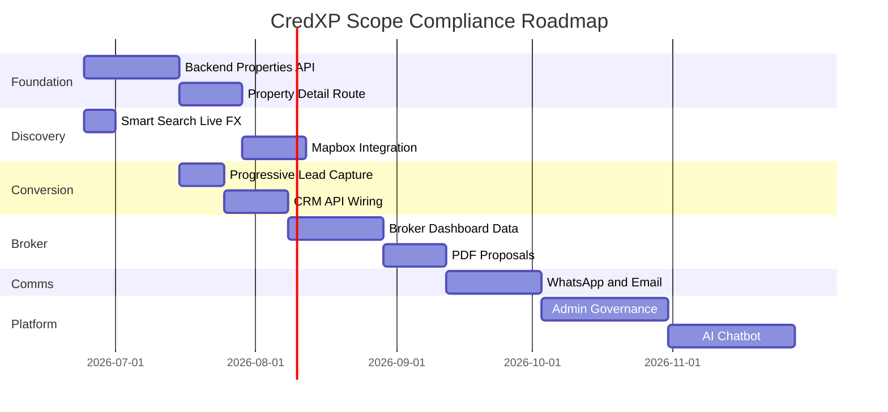

# CredXP Dubai — Implementation Roadmap

**Generated:** 2026-06-24  
**Principle:** Preserve approved UI — extend functionality and backend integration only.

---

## Roadmap Overview



---

## Sprint 0 — Completed (This Audit)

| Deliverable | Status |
|-------------|--------|
| `SCOPE_GAP_ANALYSIS.md` | ✅ |
| `IMPLEMENTATION_ROADMAP.md` | ✅ |
| `SECURITY_AUDIT.md` | ✅ |
| `PERFORMANCE_REPORT.md` | ✅ |
| Smart search steps in `PropertySearch` | ✅ |
| Calculator logic (`lib/calculators/`) | ✅ |
| Developer theme utility (`lib/theming/`) | ✅ |
| CRM + analytics stubs | ✅ |

---

## Sprint 1 — Backend Unblock (Weeks 1–3)

**Goal:** Enable live property discovery without UI changes.

| Task | Owner | Output |
|------|-------|--------|
| Deploy `GET /api/v1/properties` | Backend | Paginated listings |
| Deploy `GET /api/v1/properties/{id}` | Backend | Detail payload |
| Deploy `GET /api/v1/developers` | Backend | Developer list |
| Deploy `GET /api/v1/projects` | Backend | Project list |
| Add `propertyType` query param | Backend | Smart search filter |
| Verify auth v0.4.1 flows | Frontend | Update capability flags |
| Add `useProperty(id)` hook | Frontend | Ready for detail page |

**Exit criteria:** Homepage sections show real data; search returns results.

---

## Sprint 2 — Property Detail & Tools (Weeks 3–5)

**Goal:** Investment tools on property pages using approved styling.

| Task | Complexity |
|------|------------|
| Create `/properties/[id]` using `PortalShell` + existing card patterns | Medium |
| Mount ROI / CAGR / yield calculators (`lib/calculators/investment.ts`) | Low |
| Currency toggle on detail (reuse `lib/search/currency.ts`) | Low |
| Verified property + developer badges (data-driven) | Low |
| Brochure download (`brochureUrl` from API) | Low |
| Virtual tour iframe/embed field | Low |

**No redesign:** Reuse `LuxuryCard`, `SectionHeader`, `Button`, `theme.components.input.light`.

---

## Sprint 3 — Mapbox 3D (Weeks 5–7)

| Task | Detail |
|------|--------|
| Install `mapbox-gl` | Env: `NEXT_PUBLIC_MAPBOX_TOKEN` |
| `PropertyMap` component | 3D buildings, day/night toggle |
| Property + developer markers | GeoJSON from API |
| POI layers | Schools, metro, airports (Mapbox tilesets or custom) |
| Embed in property detail section | Same section padding as listings |

---

## Sprint 4 — Lead Capture & CRM (Weeks 4–6)

| Task | Detail |
|------|--------|
| `ProgressiveLeadCapture` component | 5 steps: country → intent → last visit → name → phone |
| Style match | `AuthFloatingInput`, `AuthGoldButton`, existing panel borders |
| `POST /api/v1/leads` | Backend endpoint |
| Wire `submitLeadToCrm()` | Replace stub |
| `trackEvent()` → GTM | Production analytics |
| Replace `mailto:` consultation | Optional — keep as fallback |

---

## Sprint 5 — Broker Portal (Weeks 7–10)

| Task | Detail |
|------|--------|
| Role detection from `/auth/me` | `AFFILIATE_BROKER` etc. |
| Dashboard widgets | Lead pipeline, activity feed, commissions |
| Saved properties API | Sync shortlist |
| Client list | CRM integration |
| Proposal CTA | Links to PDF flow |

**UI:** Extend existing `/dashboard` — do not replace `PortalShell`.

---

## Sprint 6 — PDF Proposals (Weeks 10–12)

| Task | Detail |
|------|--------|
| `app/api/proposals/generate/route.ts` | Puppeteer server-side |
| HTML template | Broker logo, property data, brand colors |
| Download + share endpoints | |
| Broker portal "Generate Proposal" action | |

**Dependency:** `puppeteer` (server-only), property + broker APIs.

---

## Sprint 7 — WhatsApp & Email (Weeks 12–15)

| Task | Detail |
|------|--------|
| `lib/services/communications.ts` | WhatsApp Cloud API + email provider |
| Send proposal | |
| Follow-up sequences | Backend job queue |
| Delivery/read webhooks | Activity timeline in broker portal |

---

## Sprint 8 — Admin Governance (Weeks 15–19)

| Task | Detail |
|------|--------|
| `/admin` route group | Reuse design tokens — no new visual identity |
| Broker CRUD | `users` API |
| Property CRUD | Properties API |
| Developer CRUD + theme CMS | `developerTheme.ts` admin form |
| Lead assignment | |
| Analytics dashboard | |
| Broadcast messaging | |

---

## Sprint 9 — AI (Weeks 19–23)

| Task | Detail |
|------|--------|
| Backend RAG over properties, developers, FAQs, Golden Visa | |
| Chat widget | Floating button — approved red primary |
| English + Hindi | i18n layer |
| Lead qualification flow | Budget, timeline, interest → CRM |

---

## Sprint 10 — Performance & Security Hardening (Ongoing)

| Task | Reference |
|------|-----------|
| `next/image` for property photos | `PERFORMANCE_REPORT.md` |
| Route-level metadata | SEO |
| `middleware.ts` auth check | `SECURITY_AUDIT.md` |
| HttpOnly cookie migration (if backend supports) | Security |
| Lighthouse audit CI | Target > 90 |

---

## Dependency Graph

```
Backend APIs (properties, developers, leads)
    ├── Property detail page
    │       ├── Calculators (ready)
    │       ├── Mapbox
    │       └── Brochure / virtual tour
    ├── Smart search (partial — live FX optional)
    ├── Lead capture → CRM
    │       ├── Broker portal
    │       ├── PDF proposals
    │       └── WhatsApp / email
    └── Admin governance
            └── AI knowledge base
```

---

## Risk Register

| Risk | Mitigation |
|------|------------|
| Backend APIs delayed | Frontend clients already built; show `ApiState` gracefully |
| Mapbox token cost | Lazy-load map only on detail page |
| Puppeteer on Render/serverless | Use dedicated PDF worker or external service |
| localStorage token XSS | See security roadmap for cookie migration |
| Scope creep into UI redesign | All PRs must not modify `design-tokens.ts` colors/typography without approval |

---

## Definition of Done (Per Feature)

1. Functionality works against live backend (or documented stub with feature flag)
2. Uses existing `theme.ts` / `Button` / `SectionHeader` / form components
3. Mobile responsive (existing breakpoints)
4. Analytics event fired where applicable
5. Documented in API report or scope gap update
