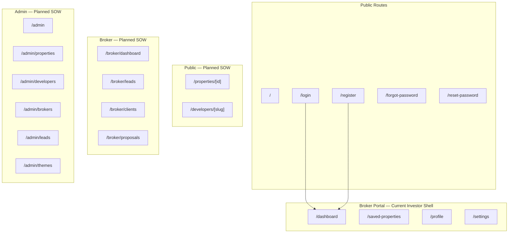

# CredXP Dubai — Route Map

**Updated:** 2026-06-24 (post SOW cleanup)  
**Total routes:** 12  
**Removed:** `/auth-debug`

---

## Route Overview



---

## Public Routes (Live)

| Route | File | Auth | SOW Feature |
|-------|------|------|-------------|
| `/` | `src/app/page.tsx` | Open | Homepage, search, listings, developers |
| `/login` | `src/app/(auth)/login/page.tsx` | Guest only | Broker/public login |
| `/register` | `src/app/(auth)/register/page.tsx` | Guest only | Broker registration |
| `/forgot-password` | `src/app/(auth)/forgot-password/page.tsx` | Guest only | Password recovery |
| `/reset-password` | `src/app/(auth)/reset-password/page.tsx` | Guest only | Password reset |

**Homepage sections (anchors, not routes):**

| Anchor | Component |
|--------|-----------|
| `#properties` | `PropertyListings` |
| `#developers` | `DevelopersSection` |
| `#consultation` | `ConsultationSection` |

---

## Broker Portal Routes (Live)

Protected by `(protected)/layout.tsx` → `ProtectedRoute`.

| Route | File | SOW Feature | Status |
|-------|------|-------------|--------|
| `/dashboard` | `src/app/(protected)/dashboard/page.tsx` | Broker dashboard | Shell + placeholders |
| `/saved-properties` | `src/app/(protected)/saved-properties/page.tsx` | Saved properties | Empty state |
| `/profile` | `src/app/(protected)/profile/page.tsx` | User profile | Functional |
| `/settings` | `src/app/(protected)/settings/page.tsx` | Account settings | Logout |

**Note:** SOW broker portal will likely use `/broker/*` route group with role guard. Current `(protected)/*` routes serve as the approved UI shell until RBAC is added.

---

## Admin Portal Routes (Planned — SOW)

| Route | SOW Feature | Status |
|-------|-------------|--------|
| `/admin` | Admin dashboard | ❌ Not created |
| `/admin/properties` | Property management | ❌ |
| `/admin/developers` | Developer management | ❌ |
| `/admin/brokers` | Broker management | ❌ |
| `/admin/leads` | Lead governance | ❌ |
| `/admin/themes` | Theme management | ❌ |
| `/admin/messaging` | Broadcast messaging | ❌ |
| `/admin/reports` | Reporting | ❌ |

---

## Public Detail Routes (Planned — SOW)

| Route | SOW Feature | Status |
|-------|-------------|--------|
| `/properties/[id]` | Property details, calculators, map, virtual tour | ❌ |
| `/developers/[slug]` | Developer page + dynamic theming | ❌ |

---

## API Routes (Planned — SOW)

| Route | SOW Feature | Status |
|-------|-------------|--------|
| `/api/proposals/generate` | PDF proposal (Puppeteer) | ❌ |
| `/api/proposals/[id]/share` | PDF share link | ❌ |
| `/api/webhooks/whatsapp` | Delivery tracking | ❌ |

---

## Removed Routes

| Route | Reason |
|-------|--------|
| `/auth-debug` | Debug tool — not in SOW |

---

## Route Protection Model

| Layer | Mechanism | Routes |
|-------|-----------|--------|
| Guest-only | `AuthShell` redirects authenticated → `/dashboard` | `/login`, `/register`, `/forgot-password`, `/reset-password` |
| Authenticated | `ProtectedRoute` redirects unauthenticated → `/login` | `/dashboard`, `/profile`, `/settings`, `/saved-properties` |
| Public | No guard | `/` |
| Server middleware | Not implemented | — |

---

## Layout Hierarchy

```
src/app/layout.tsx          → Navbar, AppProviders, fonts
├── (auth)/*                → AuthShell per page
├── (protected)/layout.tsx  → ProtectedRoute wrapper
└── page.tsx                → Homepage
```
